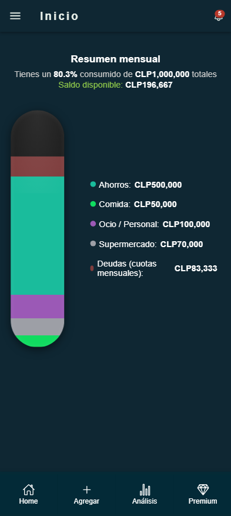
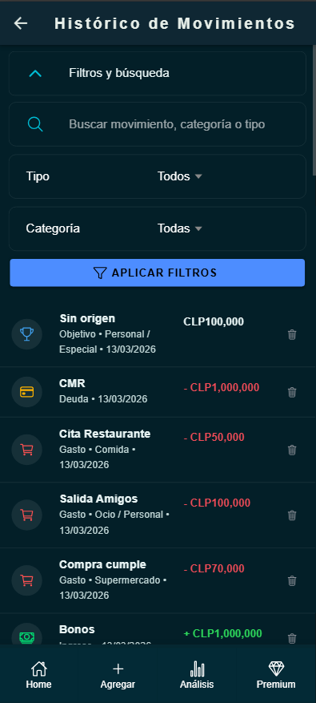
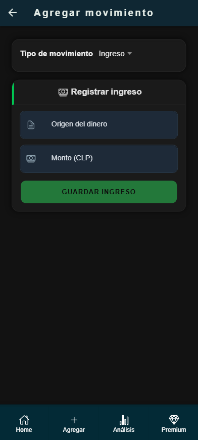
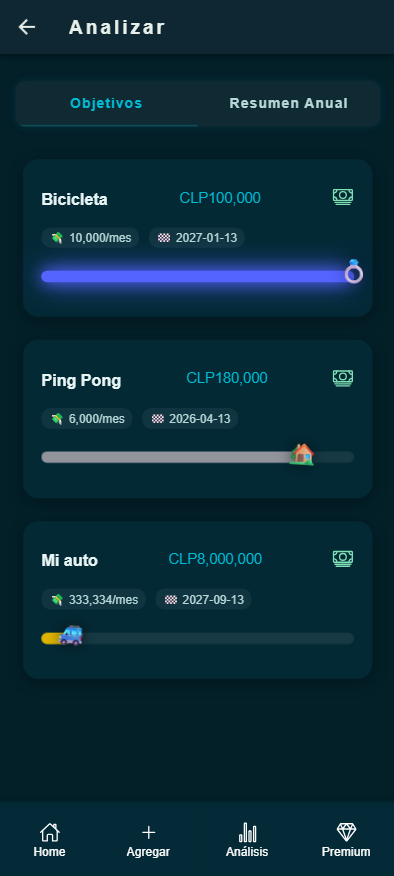

# Asistente Financiero Personal

Aplicación híbrida de **asistente financiero personal** desarrollada con Angular e Ionic.

Permite a los usuarios registrar ingresos, gastos, deudas y objetivos de ahorro, centralizando su información financiera en una aplicación móvil/web conectada a Firebase.

El proyecto fue desarrollado como Capstone de Ingeniería en Informática con el objetivo de practicar arquitectura frontend moderna, autenticación con Firebase y persistencia de datos en Firestore.

---


## Screenshots






---

## Stack Tecnologico

### Frontend
- Angular
- Ionic Framework
- TypeScript
- Capacitor

### Backend / Servicios
- Firebase Authentication
- Firebase Firestore
- API auxiliar en Flask

### Herramientas
- Node.js
- npm

---

## Funcionalidades Principales

- Registro e inicio de sesion con Firebase.
- Gestion de perfil de usuario, foto y configuraciones.
- Registro de ingresos, gastos, deudas y objetivos financieros.
- Visualizacion de historial de movimientos.
- Resumen mensual y analisis de informacion financiera.
- Sincronizacion de datos entre cliente y servicios en la nube.
- Soporte para notificaciones push y validaciones por PIN en flujos sensibles.

---

## Desafios Tecnicos

- Modelar informacion financiera en Firestore manteniendo una estructura flexible.
- Organizar la aplicacion con servicios Angular para separar UI, autenticacion y acceso a datos.
- Integrar autenticacion con Firebase y envio de token en solicitudes HTTP.
- Manejar sincronizacion de datos, cache local y consumo de APIs relativas en entorno Ionic.

---

## Estructura del Proyecto

```text
finanza/
|- src/
|  |- app/
|  |  |- pages/       # vistas principales
|  |  |- services/    # Firebase, APIs, utilidades e interceptores
|  |  |- models/      # modelos de dominio
|  |- environments/   # configuraciones por entorno
|- backend/           # API Flask usada en desarrollo/integracion
|- proxy.conf.json    # proxy local hacia /api
```

---
## Instalacion y Ejecucion

Aplicacion mobile

```bash
git clone https://github.com/AngelCzu/Capstone
cd finanza
npm install
ionic serve
```

Para desarrollo local con la API:

```bash
python -m venv venv
pip install -r requirements.txt
python backend/app.py
```

---
## Posibles Mejoras Futuras

- Dashboard con metricas comparativas y graficos mas avanzados.
- Tests unitarios y de integracion para servicios criticos.
- Configuracion centralizada de endpoints por entorno de despliegue.
- Exportacion de reportes y presupuestos personalizados.


## Autor

**Angel Gabriel Cea Zúñiga**

Desarrollador de Software Junior  
Ingeniería en Informática – Duoc UC

GitHub: https://github.com/AngelCzu